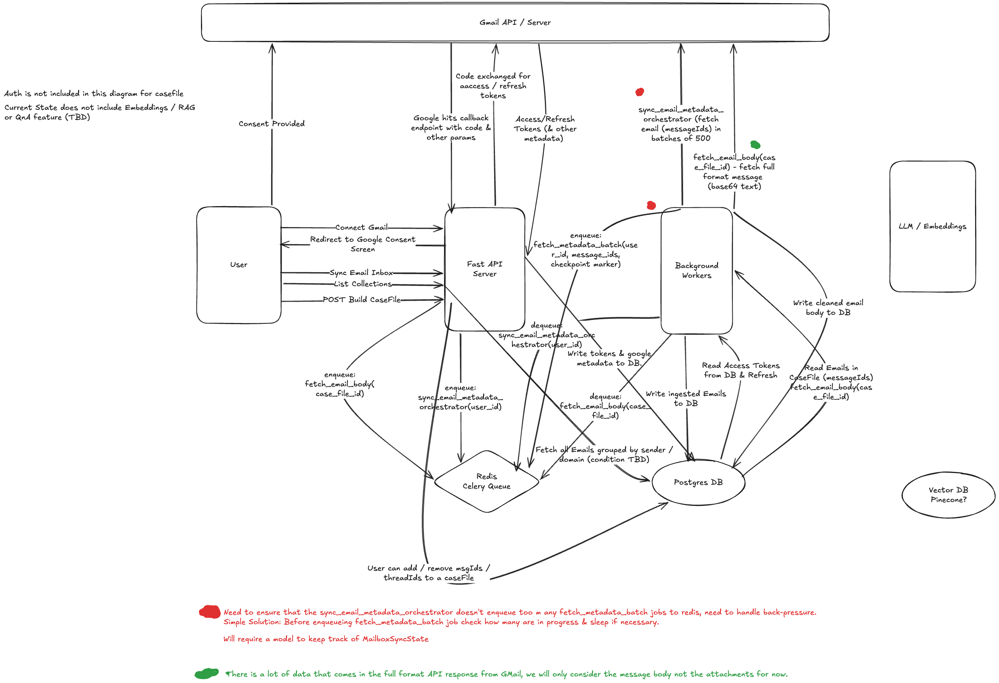

# 1. Product Overview

**Concise one-liner**: *CaseFile turns your conversations into documented history you can prove.*

**Verbose one-liner**: *CaseFile helps users understand and prove what was agreed in email conversations by turning long email threads into searchable timelines with cited answers.*

### Technical Overview

Casefile ingests a user's Gmail mailbox using the Gmail API and builds a structured metadata index of all messages.  
Metadata ingestion is performed asynchronously via Celery workers to handle large mailboxes (100k+ emails) safely.

Email bodies are not fetched immediately. Instead, they are lazily retrieved when a user creates or opens a Casefile.  
This significantly reduces API usage, cost, and processing time.

The system separates:
- ingestion (metadata sync)
- enrichment (body fetch + parsing)
- intelligence (search + embeddings)

FastAPI handles user interaction and job orchestration, while background workers perform heavy I/O operations.

### Problem

Users regularly deal with long running email conversations (housing disputes, solicitors, insurance, contractors, complaints). Important decisions and numbers are buried across months/years of email and are difficult to retrieve.

- Conversations span multiple threads
- Agreements change over time
- Evidence is needed, not just retrieval
- Users (myself) do not remember all the details / keywords.

# 2. Target User

Individuals dealing with ongoing administrative or legal-adjacent email processes.

Examples:

- leaseholders (service charge disputes)
- property buyers/sellers
- insurance claims
- dealing with solicitors
- freelancers managing clients

# 3. Core User Journey

## Connect Email Account

User connects gmail via OAuth and we store: **`access & refresh (tokens`)**, **`email`** & **`google_user_id`**

## Metadata Ingestion

Leveraging the Gmail API we pull all messageIds, once those messageIds are fetched we begin to pull metadata: `threadId, sender, recipients, subject, snippet, date`.

*At this point I pause and consider whether it is worth applying filters prior to fetching all emails as we may not want SPAM or Promotional emails only those that appear in the inbox.*

## Relationship Detection

We then cluster emails by sender domain and also showing the number of individual threads within a cluster.

These clusters form a **Casefile** when selected.

## **Deep Processing**

*Only when a Casefile is selected**

We fetch the full message bodies for those messageIds → decode base 64 text → parse → chunk → embed*

Chunks will contain metadata {`message_id, thread_id, from, date, subject`} - I could also store the index of the message as to where it belongs in the thread.

***Chunking method used is of importance ([See chunking strategies](https://www.pinecone.io/learn/chunking-strategies/))* - *but I can get a good initial first draft by just treating the individual messages as chunks*.**

## Q & A

When a user asks a query we embed the query and perform a dot product on the chunks within our vector DB (pulling out only the relevant chunks) - we send the data to an LLM and produce an answer with citations.

*In the future we can consider analysing query types / patterns to use different retrieval strategies.*

# 4. Functional Requirements

- Gmail Oauth
- Metadata ingestion
- Casefile creation
- Email body decoding
- Embeddings
- RAG Search
- Citations on answers

*Future Improvements may include:* 

- Timeline View
- Document Uploads (PDFs)
- Parsing attachments in Emails
- Notifications (”alerting user of any contradictions”)

# 5. Non-Functional Requirements

**Performance**:

- Casefile creation < 1 minute for 100 emails
- Query Response < 5 seconds

**Security:**

- Encrypted tokens (not going to do this for now)
- per-casefile processing, do not include context outside of the casefile.

**Cost**:

- Embeddings must be incremental (never embed the entire dataset from scratch, only embed new or changed emails as they arrive).
- Avoid re-embedding unchanged emails

# 6. Architecture

